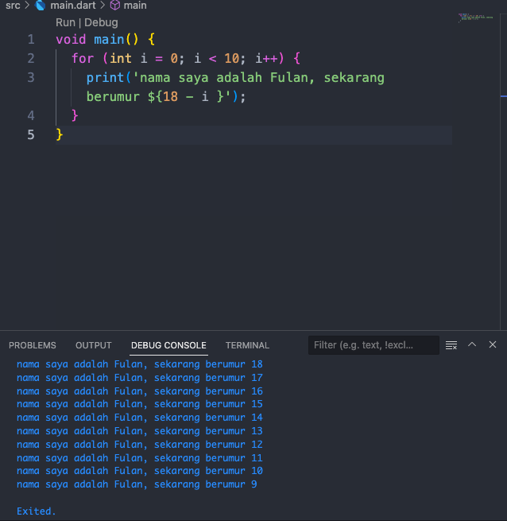

# Arsyanda Irza Rabbani Yuardhino
# 2141720245
# Week - 2
# Soal No. 1

# Soal No.2
Mengapa sangat penting untuk memahami bahasa pemrograman Dart sebelum kita menggunakan framework Flutter ? Jelaskan!

Memahami Dart sangat penting sebelum menggunakan framework Flutter karena Dart adalah bahasa yang digunakan Flutter untuk membuat aplikasi seluler.
# Soal No. 3
Rangkumlah materi dari codelab ini menjadi poin-poin penting yang dapat Anda gunakan untuk membantu proses pengembangan aplikasi mobile menggunakan framework Flutter.

 **Dari yang saya rangkum, hal penting dari Codelab ini adalah**
 
1. **Pengenalan Flutter** : Apa itu Flutter? 
2. **Struktur Proyek Flutter** : penjelasan direktori dan file penting dalam proyek Flutter
3. **Widget dan Tampilan UI** : Cara membangun antarmuka pengguna (UI) dengan widget
4. **Routing dan Navigasi** : Cara menavigasi antara halaman atau layar dalam aplikasi Flutter
5. **pengujian dan Debugging** : Pengujian unit dan integrasi 